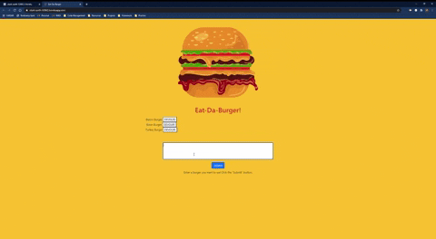
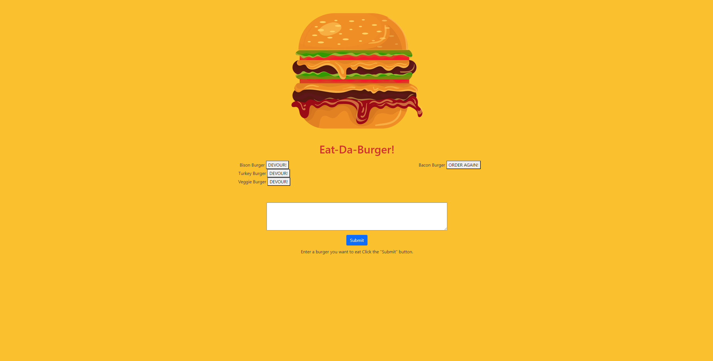

# Eat-Da-Burger!

## Description 
This is an app where the user can track burgers that they would like to eat. Once the burger is created, it is added to the devour section, where the burgers are waiting to be consumed! Once the burger has been devoured, it will move to a devoured section where it can then be ordered again!

---

## Table of Contents

* [Installation](#installation)
* [Usage](#usage)
* [Screenshots](#screenshots)
* [Tests](#tests)
* [Deployed Site](#deployed-site)
* [Contributing](#contributing)
* [Questions](#questions)
* [License](#license)

---

## Installation
1) Copy the HTTPS link from repository 
2) Open the folder you wish to add this application to in your code editor. 
3) Open the integrated terminal in the selected folder. 
4) Run git clone and paste HTTPS link from repository. 
5) Run "npm i" to install  the node modules associated with this application.
6) Change password in config.json under development to match your MySQL password
7) In the terminal, type in "node server.js" to run the application, enjoy!

---

## Usage 

---

## Screenshots

---

## Tests
[Test of the application](https://drive.google.com/file/d/1Hq41ZGeWSXItgq8TQYrJVUTcXQOcP0p3/view?usp=sharing)

---

## Deployed Site
[Live Site](https://stark-earth-52662.herokuapp.com/)

---

## Contributing
Anyone can contribute to this application by forking the repo, adding their code to the application, and then sending any of the contributors a pull request so the main branch can be updated.

---

## Questions

You can find my GitHub profile by clicking this link: [My GitHub Profile](https://github.com/mrosavourazeris)

If you have any questions you can email me at: [My Email](test@test.com)

---

## License Under

### MIT License

Permission is hereby granted, free of charge, to any person obtaining a copy
of this software and associated documentation files (the "Software"), to deal
in the Software without restriction, including without limitation the rights
to use, copy, modify, merge, publish, distribute, sublicense, and/or sell
copies of the Software, and to permit persons to whom the Software is
furnished to do so, subject to the following conditions:

The above copyright notice and this permission notice shall be included in all
copies or substantial portions of the Software.

THE SOFTWARE IS PROVIDED "AS IS", WITHOUT WARRANTY OF ANY KIND, EXPRESS OR
IMPLIED, INCLUDING BUT NOT LIMITED TO THE WARRANTIES OF MERCHANTABILITY,
FITNESS FOR A PARTICULAR PURPOSE AND NONINFRINGEMENT. IN NO EVENT SHALL THE
AUTHORS OR COPYRIGHT HOLDERS BE LIABLE FOR ANY CLAIM, DAMAGES OR OTHER
LIABILITY, WHETHER IN AN ACTION OF CONTRACT, TORT OR OTHERWISE, ARISING FROM,
OUT OF OR IN CONNECTION WITH THE SOFTWARE OR THE USE OR OTHER DEALINGS IN THE
SOFTWARE.
